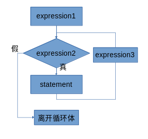

# C语言简单入门之——控制结构

作者：[Mizuren Nanako](https://gitee.com/Tomnycui), All Rights Reserved.

## 什么是控制结构？

可以先看如下部分的代码：

```c

#include <stdio.h>

int main()
{
    int a=0;
    scanf("%d", &a);
    if (a > 0)
        printf("positive\n");
    else 
        printf("negative\n");
    return 0;
}
```

很简单，就是读取int数a,根据条件`a > 0`是否满足决定输出是`"positive\n"`还是`"negative\n"`。
注意到，一般程序是按顺序从上向下执行的，而这里使用`if-else`结构产生了**条件分支**，使得程序有了选择和决策的过程。把这种对于程序每行指令的执行顺序有影响的结构叫作**控制结构**。

## 那么，有什么控制结构呢？

按照功能，可以把控制结构划分为几种类型：

1. 顺序结构，在这种结构意味着程序顺序执行。
2. 分支结构（也叫作*条件分支、逻辑判断*之类的，只要喜欢），这种结构使得程序可以产生决策和分支。简单的说就是根据某个条件是否成立来决定走哪条路。
3. 循环结构，这种结构具有循环特性。简单的说，以下流程属于循环结构：「A→B→C→回到A」，这会使得执行顺序是ABCABC……的循环。此处的例子是一个**无限循环**，实际运用的时候循环结构总会和分支结构同时出现以便在合适的时候离开循环。
4. 递归结构，直观上，可以百度数学上的[分形](https://baike.baidu.com/item/%E5%88%86%E5%BD%A2/85449)。这种结构在真正学到**函数**之前不会进行涉及。*这可能会是一个超出理解的概念。*
5. `goto`语句。严格的说，这不算是一种结构而是达成结构的手段。但是我也不建议在程序中使用`goto`语句，这会导致程序可读性骤降和被老师骂。

### 顺序结构

最为常见的是顺序结构。这种结构不需要特殊注明，因为程序中的所有语句都默认是顺序结构。如果一定要给出一个标记，我认为是*大括号*。所有被大括号**包含**的**语句**都默认遵循顺序结构。

### 分支结构

C的分支结构实现上有`if-else`和`switch-case`两种，对应**双分支**和**任意分支**。

#### `if-else`结构

首先给出`if-else`的**完整结构**：其中`expression`、`statement`均表示语句。

```c
if (expression1)
{
    statement1;
}
else if (expression2)
{
    statement2;
}
else if ......
......
else
{
    statementN;
}
```

直接理解：若`expression1`为**真**，执行`statement1`；**否则**，如果`expression2`为**真**，执行`statement2`；否则，……；否则，执行`statementN`。
相信这个逻辑已经足够清晰。

#### `switch-case`结构

同样，给出基本形式：

```c
switch(expression)
{
    case value1:
        statement1;
        break;
    case value2:
        statement2;
        break;
    //......
    case default:
        statementN;
        break;
}
```

直接理解：先计算`expression`的值。如果这个值是`value1`，从`case value1:`的标记处**开始执行**（重点！）；如果这个值是`value2`，从`case value2:`的标记处开始执行；……；如果以上所有情况都不符合，从`case default:`的标记处开始执行。
首先第一个重点就是这种结构是先计算了表达式`expression`的值来进行比对的。第二个重点是当`expression`的值等于某个**标记**例如`case value1:`的时候，是从该标记处**开始执行**代码而不是只执行那个标记框定的代码。在这个例子里面，如果`case value1:`的语句结束之后没有加多一句`break;`，程序将会继续执行下去，执行`case value2:`标记下面的代码……直到遇到`break;`或者这一层的右大括号。**请务必理解。** 此外还要注意`break;`的语义：无条件地**离开**当前所在的switch结构的大括号。（相当于直接跳到右括号）

为了更清晰，此处给出实例：

```c
#include <stdio.h>

int main()
{
    int a=0;
    scanf("%d", &a);
    switch (a)
    {
    case 0:
        printf("0");
    case 1:
        printf("1");
    case 2:
        printf("2");
        break;
    case 3:
        printf("3");
    case default:
        printf("def");
    }
    printf("\n");
    return 0;
}
```

此程序会要求一个整数a,接下来是获取到a的值之后程序的输出：
*（为了和赋值号`=`相区别，C用双等号`==`作为**等值判定号**，此处维持C的习惯）*

- a==0，输出是`012`+*换行符*。
- a==1，输出是`12`+*换行符*。
- a==2，输出是`2`+*换行符*。
- a==3，输出是`3def`+*换行符*。
- a==（其他数字），输出是`def`+*换行符*。

请对照理解。

### 循环结构

循环结构是计算机能够进行反复的机械的操作的关键。
先配一张图：

这就是一个很典型的循环结构，`expression1`执行完之后直接进入对`expression2`的判断然后以此为循环条件进行循环。这张图相信这一届旧高考过的都会看。这个图片表达到c的代码里面是这样的：

```c
for (expression1; expression2; expression3)
{
    statement;
}
//离开循环体
```

请对照上图理解。
现在写一个循环的小程序：
**（案例1）**

```c
#include <stdio.h>

int main()
{
    int s = 0, i = 0;
    for (i = 0; i < 100; ++i)
    {
        s += i;
    }
    printf("%d\n", s);
}
```

输出应该是：`5050`+换行符。
注意到`expression1`其实可以写在`for`外面，`expression3`其实可以和`statement`合并 **（看流程图）** ，所以这个程序又可以写成：
**（案例2）**

```c
#include <stdio.h>

int main()
{
    int s = 0, i = 0;
    for (; i < 100;)
    {
        s += i;
        ++i;
    }
    printf("%d\n", s);
}
```

这里发现好像`expression2`是一定要写的，其实不是，也可以合并到`statement`里面去。
**（案例3）**

```c
#include <stdio.h>

int main()
{
    int s = 0, i = 0;
    for (;;)
    {
        if (i >= 100)
        {
            break;
        }
        s += i;
        ++i;
    }
    printf("%d\n", s);
}
```

其中`break`跳出当前层的循环。可以对比一下上面`switch-case`的`break`，这两者是一样的。
**以上就是`for`循环的所有形态。**
对于**案例2**里面的`for`的写法，只用到了`expression2`，这种情况可以写成`while`循环：
**（案例4）**

```c
#include <stdio.h>

int main()
{
    int s = 0, i = 0;
    while (i < 100)
    {
        s += i;
        ++i;
    }
    printf("%d\n", s);
}
```

有时候希望循环在每次循环结束的时候进行判断而不是在进入循环之前进行判断，那么有`do-while`循环：
**（案例5）**

```c
#include <stdio.h>

int main()
{
    int a = 0;
    do 
    {
        printf("loop\n");
        ++a;
    } while (a < 0);
}
```

输出是：一行：`loop`+换行符。
可以看到**循环条件是否满足**的判断是在每次循环的末尾进行的。
**以上就是所有常规的循环结构。** 此外，`goto`语句也可以构建循环。见下文。

### 递归结构

算法相关，以后单独开文章讲。

### `goto`语句

为了防流氓题目，起码得会读。
和字面意思一样，`goto XXX;`就是将程序执行点立刻跳转到标签`XXX`处。看如下程序：

```c
#include <stdio.h>

int main()
{
    int a=0;
    scanf("%d", &a);
    if (a > 0)
        goto hehehe;
    else 
        goto hohoho;
hahaha:
    return 0;
hehehe:
    printf("positive\n");
hohoho:
    printf("negative\n");
    goto hahaha;
}
```

初看起来可能有点迷惑，其实十分清晰。
一开始程序顺序执行，到`if (a > 0)`的时候进入条件分支。如果`a > 0`成立，执行`goto hehehe;`，进行一个到标签`hehehe:`的跳转。跳转后下一跳语句是：`printf("positive\n");`，按顺序往下走，是`printf("negative\n");`，然后是`goto hahaha;`，之后跳到标签`hahaha:`，跳完下一条语句就是`return 0;`，`main`函数返回`0`，因此程序结束。
回到刚刚的分支点：如果`a > 0`不成立，执行`goto hohoho;`，跳完下一条语句就是`printf("negative\n");`，然后是`goto hahaha;`，之后跳到标签`hahaha:`，跳完下一条语句就是`return 0;`，`main`函数返回`0`，因此程序结束。

`goto`跳转的**关键**是要先**插入标记**，之后goto就可以无条件地跳到对应的标记。
另一个规则是：`goto`只能在同一个函数内跳转。例如`main`函数里面的`goto`就只能在`main`函数的大括号里面跳，不能跳到其他函数里面去。
